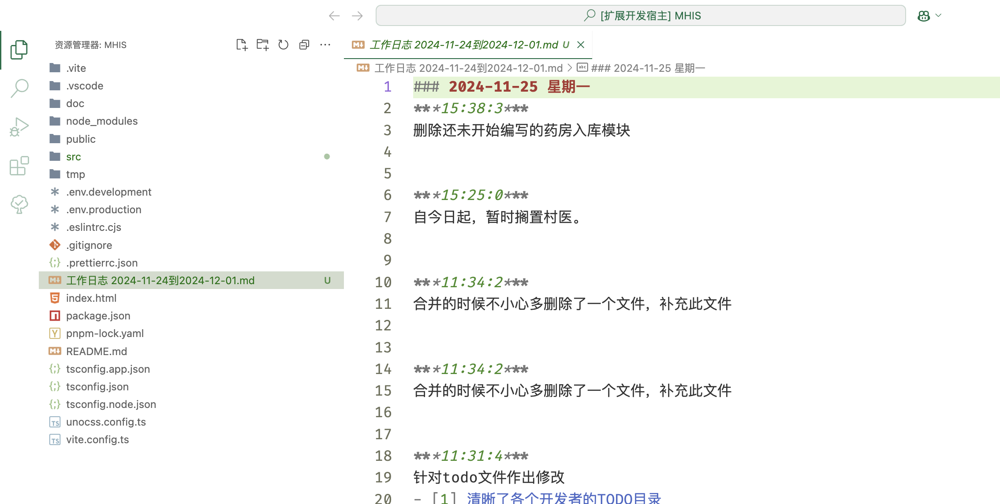
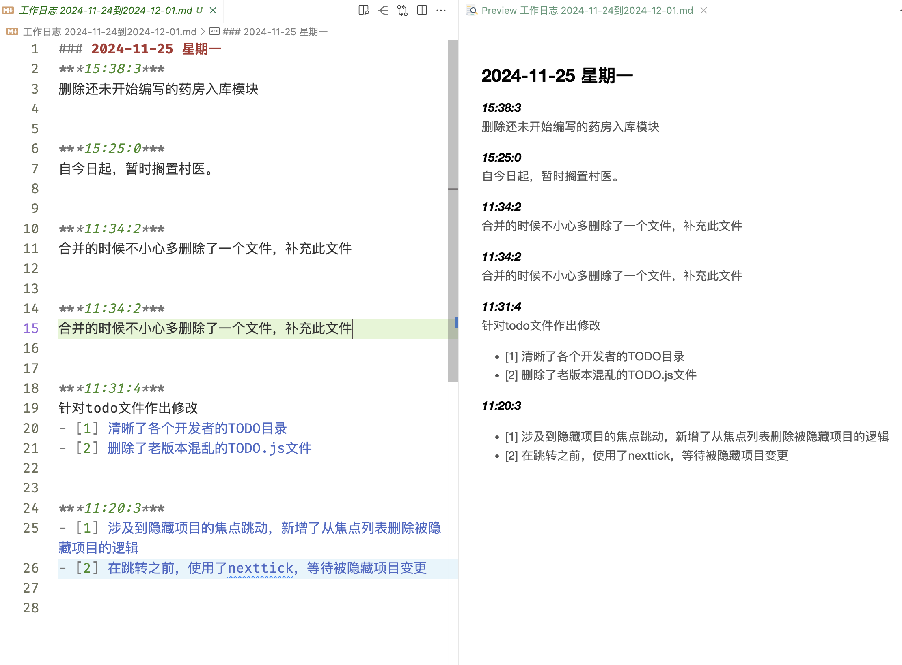

# 工作日志（Work Diary）

## 简介

生成周报。

## 功能

利用当前项目的提交记录，自动生成周报。
避免工作里面重复恶心的部分。

## 要求

- 规范提价，使用`回车`，`换行`来分割不同的内容。
- 鼓励多提交，每做完一个功能就提交。

_好处是：_

1.  代码回溯更加方便；
2.  使得您的周报内容翔实；
3.  并且保证你的代码足够的安全；

_比如：我编写一个提交说明_

```
暂时保存，将继续开发时间组件部分。
1、修复了时间组件BUG；
2、增加了时间组件的测试用例；
3、增加了时间组件的文档；
```

## 使用

_打开命令面板_
_MacOs `Command+Shift+P`_
_Windows/Linux `Ctrl+Shift+P`_

1. 打开命令面板，输入`Get Work Diary`；
2. 根据提示输入开始时间，不输入默认 7 天前；
3. 根据提示输入结束时间，不输入默认今天；

在当前目录生成类似`工作日志 2024-11-24到2024-12-01.md` 的文件。

#### 工作日志 `2024-11-24 到 2024-12-01.md` 格式如下：

```markdown
### 2024-11-25 星期一

**_15:38:3_**
删除还未开始编写的药房入库模块

**_11:34:2_**
合并的时候不小心多删除了一个文件，补充此文件

**_11:31:4_**
针对 todo 文件作出修改

- [1] 清晰了各个开发者的 TODO 目录
- [2] 删除了老版本混乱的 TODO.js 文件

**_11:20:3_**

- [1] 涉及到隐藏项目的焦点跳动，新增了从焦点列表删除被隐藏项目的逻辑
- [2] 在跳转之前，使用了 nextTick，等待被隐藏项目变更
```

之后你就可以把这个东西放在“钉钉”或者其他什么地方去了。




---


